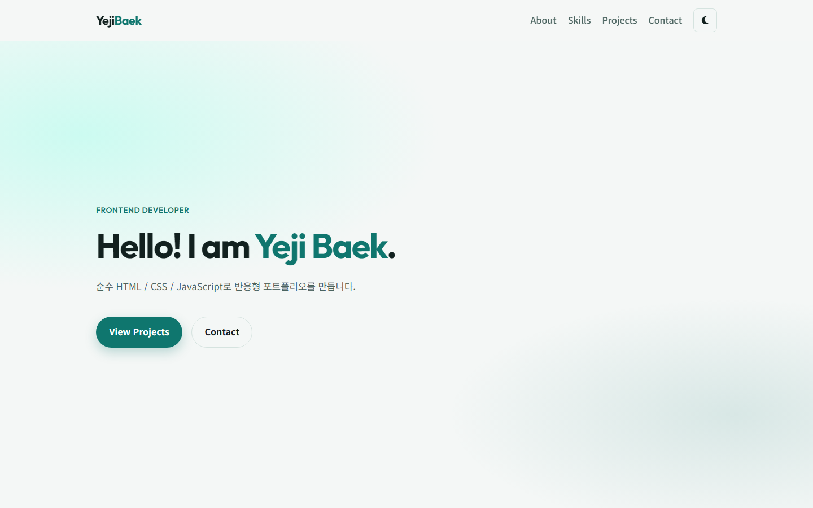
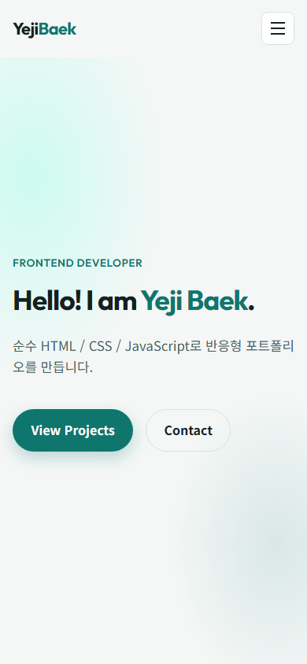
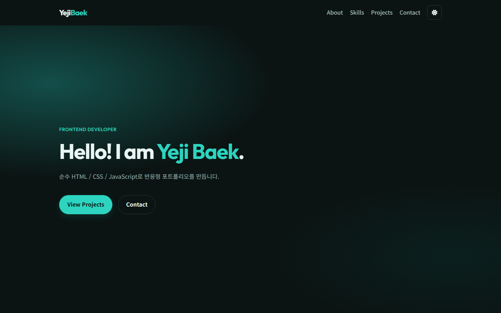

# Interactive Web Portfolio

순수 HTML, CSS, JavaScript로 만든 반응형 개인 포트폴리오입니다.
사용자 이벤트 → 상태 변경 → DOM 업데이트 흐름과 GitHub API의 로딩/성공/에러/빈 상태 처리를 중심으로 구현했습니다.

---

## 배포 URL

- **GitHub Pages**: [https://yejibaek12.github.io/B4-1.interactive_web_portfolio/](https://yejibaek12.github.io/B4-1.interactive_web_portfolio/)
- **저장소**: [https://github.com/yejibaek12/B4-1.interactive_web_portfolio](https://github.com/yejibaek12/B4-1.interactive_web_portfolio)

---

## 주요 특징

- **모바일 퍼스트 반응형**: Hero, About, Skills, Projects, Contact, Footer 구성. 브레이크포인트 768px(태블릿), 1024px(데스크톱). 모바일에서는 햄버거 메뉴 사용
- **다크 모드**: CSS 변수(`:root` / `[data-theme="dark"]`) + `localStorage`로 새로고침 후에도 유지
- **인터랙션**: 부드러운 스크롤, 스크롤 탑 버튼, 스크롤 시 네비게이션 스타일 변경, Intersection Observer 페이드인
- **Contact 폼**: 필수값·이메일 형식 검증, 필드 옆 에러 메시지, 제출 시 성공 안내
- **GitHub API 연동**: 공개 저장소를 Projects 카드로 렌더링. 로딩 / 성공 / 에러(재시도) / 빈 상태 UI. Rate Limit(403) 포함

### 스크롤·애니메이션 기준값

| 항목 | 기준 |
|------|------|
| 네비게이션 스타일 변경 | 스크롤 **60px** 이상 |
| 스크롤 탑 버튼 표시 | 스크롤 **300px** 이상 |
| Intersection Observer | `threshold` **0.2** |

---

## 사용 기술

- HTML5 (시맨틱 마크업)
- CSS3 (Flexbox, Grid, CSS 변수, 미디어 쿼리)
- Vanilla JavaScript (DOM API, `localStorage`, Intersection Observer, ES6+)
- GitHub REST API (`fetch` / `async`·`await`)
- Font Awesome, Google Fonts (Outfit, Noto Sans KR)

---

## 프로젝트 구조

```
B4-1.interactive_web_portfolio/
├── index.html
├── css/style.css
├── js/main.js
└── images/profile.svg
```

---

## 로컬 실행

1. VS Code에서 프로젝트 폴더를 엽니다.
2. Live Server 확장을 설치합니다.
3. `index.html` 우클릭 → **Open with Live Server**

브라우저에서 `index.html`을 직접 열어도 동작합니다. GitHub API는 인증 없이 **시간당 60회** 제한이 있으니 짧은 시간 내 반복 새로고침은 피하는 것이 좋습니다.

---

## 스크린샷

<!-- 데스크톱 / 모바일 / 다크모드 이미지를 docs/ 등에 넣은 뒤 아래 주석을 해제하세요



-->
